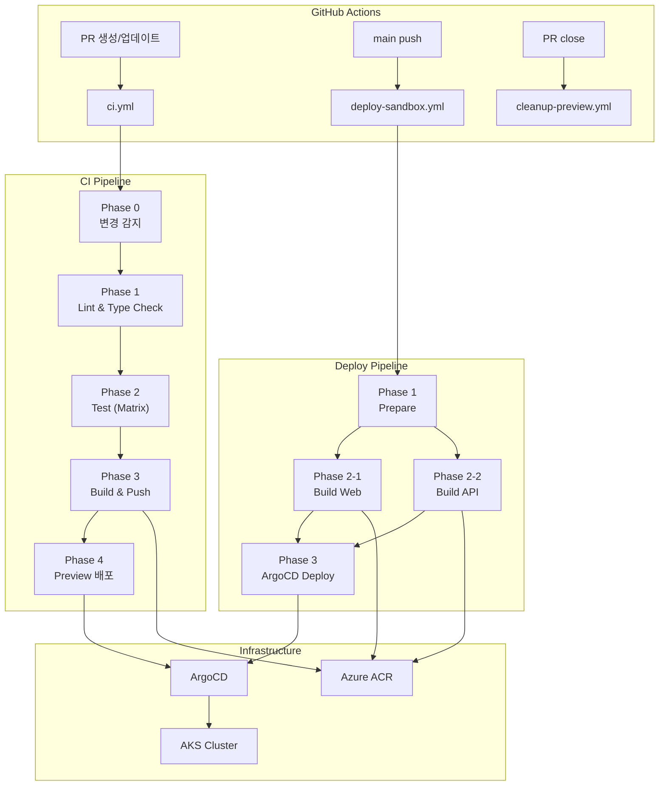
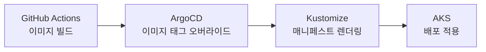

PR을 올린다. 3분 후 Slack에 메시지가 온다. "Preview 환경이 준비되었습니다." 링크를 클릭하면 방금 작성한 코드가 실제 Kubernetes 클러스터에서 돌아가고 있다. 자체 DB 스키마까지 격리된 완전한 환경이다. PR을 닫으면? 네임스페이스, DB 스키마, 컨테이너 이미지까지 자동으로 정리된다.

이 글은 Next.js + NestJS 모노레포 프로젝트에서 GitHub Actions, ArgoCD, AKS를 엮어 이 파이프라인을 구축한 과정을 다룬다. 어떤 도구를 선택했는지보다, **왜 그런 결정을 했는지**에 초점을 맞췄다.

## 파이프라인 전체 그림

워크플로우는 딱 세 개다. Git 이벤트 하나에 워크플로우 하나가 대응한다.



| 워크플로우 | 트리거 | 하는 일 |
|-----------|--------|---------|
| `ci.yml` | PR 생성/업데이트 | 린트, 테스트, 빌드, Preview 환경 배포 |
| `deploy-sandbox.yml` | main push | Sandbox 환경 자동 배포 |
| `cleanup-preview.yml` | PR close | Preview 환경 완전 정리 |

복잡해 보이지만 원칙은 단순하다. **PR은 Preview로, main은 Sandbox로, 닫히면 정리한다.**

## 변경 감지: 모노레포에서 모든 걸 빌드하지 않는 법

모노레포의 가장 큰 함정은 "API 한 줄 고쳤는데 Web까지 빌드되는" 상황이다. CI 비용이 눈덩이처럼 불어난다.

이 프로젝트에서는 `dorny/paths-filter`로 Phase 0에서 변경 영역을 먼저 감지한다. Web 코드만 바뀌었으면 API 빌드는 건너뛴다. 공유 라이브러리(`libs/`)가 바뀌면 양쪽 다 빌드한다.

그 위에 Nx의 `affected` 명령을 얹었다. `pnpm nx affected -t test`는 의존성 그래프를 분석해서 실제로 영향받는 프로젝트만 테스트한다. 두 레이어의 필터링이 겹치면서, PR 하나에 필요한 CI 시간이 체감상 절반 이하로 줄었다.

동시성 제어도 중요했다. 같은 PR에 커밋을 연속으로 push하면 이전 CI가 자동 취소된다. `concurrency` 그룹에 PR 번호를 넣고 `cancel-in-progress: true`를 설정하면 된다. 단순하지만 CI 비용 절감 효과가 크다.

## PR별 Preview 환경: 격리의 기술

이 파이프라인에서 가장 공들인 부분이다. PR마다 완전히 격리된 환경을 자동으로 만든다.

격리는 세 가지 차원에서 이루어진다:

**네임스페이스 격리** — PR마다 `pr-{번호}` 네임스페이스가 생성된다. Web Deployment, API Deployment, Service, Ingress가 모두 이 네임스페이스 안에 들어간다. 다른 PR의 리소스와 섞이지 않는다.

**데이터베이스 격리** — 가장 고민했던 부분이다. PR마다 PostgreSQL 인스턴스를 따로 띄우면 리소스 낭비가 심하다. 대신 PostgreSQL의 스키마 격리를 선택했다. 하나의 DB 인스턴스를 공유하되, PR마다 `pr_{번호}` 스키마를 생성한다. Migration Job이 PreSync Hook으로 실행되면서 스키마를 초기화한다.

**네트워크 격리** — Ingress에 `pr-{번호}.{도메인}` 형태의 호스트를 설정한다. nip.io를 활용하면 DNS 설정 없이 IP 기반으로 바로 접근 가능하다.

이 세 가지를 Kustomize overlay로 관리한다. base 매니페스트는 공통이고, PR별 변수(네임스페이스, DB 스키마, Ingress 호스트)만 patch로 오버라이드한다.

```
manifests/
├── apps/
│   ├── base/           # 공통 Deployment, Service, Ingress
│   │   ├── api/
│   │   ├── web/
│   │   └── ingress.yaml
│   └── kustomization.yaml
└── overlays/
    └── pr/             # PR Preview 오버라이드
        ├── cleanup-job.yaml
        └── kustomization.yaml
```

## 빌드 전략: Web과 API가 다른 이유

같은 모노레포 안의 두 앱이지만, 빌드 전략이 완전히 다르다. 이유가 있다.

**Web (Next.js)** — standalone 모드로 빌드한다. Next.js가 서버 코드와 필요한 node_modules를 하나의 디렉토리로 번들링한다. Nx 모노레포에서는 `outputFileTracingRoot`를 루트로 설정해야 모노레포 구조의 의존성을 제대로 추적한다. Base image는 `node:20-alpine`이다. 순수 JavaScript만 실행하면 되니까 경량 이미지로 충분하다.

**API (NestJS)** — `pnpm deploy --prod`로 프로덕션 의존성만 추출한다. 여기서 문제가 하나 있었다. PDF 처리 라이브러리가 canvas를 런타임 의존성으로 요구하는데, canvas는 glibc가 필요하다. Alpine Linux는 musl을 쓰므로 호환되지 않는다. 결국 API의 base image는 `node:20-slim`(Debian)을 선택했다. 이미지 크기는 커졌지만, 런타임 호환성이 우선이다.

이미지 태그 규칙도 환경별로 구분된다:

| 환경 | 태그 형식 | 예시 |
|------|-----------|------|
| PR Preview | `pr-{번호}-{SHA}` | `pr-42-a1b2c3d` |
| Sandbox | `{날짜시간}-{SHA}` + `latest` | `20260302-143000-a1b2c3d` |

PR 태그에는 `latest`를 붙이지 않는다. Preview 환경은 특정 커밋에 고정되어야 하기 때문이다.

## GitOps 배포: ArgoCD + Kustomize

배포는 ArgoCD가 담당한다. GitHub Actions는 이미지를 빌드하고 ArgoCD에 "이 이미지로 배포해"라고 알려주기만 한다. 실제 Kubernetes 리소스 생성과 관리는 ArgoCD의 몫이다.



핵심은 `argocd app set --kustomize-image` 명령이다. ArgoCD Application의 이미지 태그만 변경하면, ArgoCD가 자동으로 diff를 감지하고 sync한다. 매니페스트 파일을 직접 수정할 필요가 없다.

시크릿은 SealedSecrets로 관리한다. 암호화된 시크릿 파일을 Git에 커밋할 수 있으므로, 매니페스트와 시크릿을 같은 레포에서 관리하는 GitOps 원칙을 지킬 수 있다. cluster-wide scope로 설정해서 네임스페이스에 관계없이 복호화가 가능하다.

## Cleanup: PR을 닫으면 벌어지는 일

Preview 환경을 자동으로 만드는 것만큼 중요한 게 자동 정리다. PR이 닫히면 `cleanup-preview.yml`이 트리거되어 다섯 가지를 순서대로 정리한다.

1. **Git Tags 삭제** — `pr-{번호}-*` 패턴의 태그를 모두 삭제한다. ArgoCD가 이 태그로 리비전을 참조하기 때문에 먼저 지워야 한다.
2. **ArgoCD Application 삭제** — cascade 삭제로 하위 리소스까지 정리한다.
3. **Kubernetes Namespace 삭제** — 네임스페이스를 지우면 안의 모든 리소스가 함께 사라진다.
4. **DB Schema DROP** — PreDelete Hook Job이 해당 PR의 PostgreSQL 스키마를 DROP한다. 데이터가 남지 않는다.
5. **컨테이너 이미지** — ACR의 retention policy가 일정 기간 후 자동 정리한다. 별도 처리가 필요 없다.

PR이 오래 열려 있다가 닫혀도, 며칠 전 머지된 PR이 닫혀도, 동일한 정리 프로세스가 동작한다. 리소스 누수 없이 깔끔하게 정리된다.

## 설계 결정 정리

| 결정 | 선택 | 왜 |
|------|------|-----|
| 변경 감지 | `dorny/paths-filter` + Nx affected | 모노레포에서 불필요한 빌드 방지, CI 비용 절감 |
| PR 동시성 | `concurrency` + cancel-in-progress | 연속 push 시 이전 CI 자동 취소 |
| Preview DB | PostgreSQL 스키마 격리 | DB 인스턴스 공유로 리소스 절약, 충분한 격리 |
| 시크릿 | SealedSecrets (cluster-wide) | Git에 암호화 저장, GitOps 원칙 준수 |
| 이미지 레지스트리 | Azure ACR | AKS와 같은 클라우드, 네트워크 비용 없음 |
| 배포 | ArgoCD + Kustomize | GitOps 원칙, overlay 기반 환경별 설정 |
| Web image | `node:20-alpine` | 경량, standalone 호환 |
| API image | `node:20-slim` | canvas(glibc) 의존성 때문에 Debian 필수 |

## 솔직한 평가

**잘 된 것:**
- PR별 Preview 환경은 코드 리뷰 품질을 확실히 높였다. 리뷰어가 직접 동작을 확인할 수 있으니까.
- 변경 감지 + Nx affected 조합으로 CI 시간이 체감상 절반으로 줄었다.
- Cleanup이 자동이라 리소스 누수 걱정이 없다.

**아쉬운 점:**
- Smoke Test가 아직 placeholder다. Preview 환경이 뜨는 건 확인하지만, 실제 E2E 테스트는 수동이다.
- SealedSecrets는 키 로테이션 시 모든 시크릿을 재암호화해야 한다. 규모가 커지면 번거로울 수 있다.
- Preview 환경의 초기 배포가 cold start 때문에 3분 정도 걸린다. 이미지 캐싱으로 개선 여지가 있다.

## 정리

CI/CD 파이프라인의 핵심은 도구가 아니라 **"PR 하나가 코드부터 배포까지 자동으로 흘러가는 흐름"**을 설계하는 것이다.

GitHub Actions가 코드를 빌드하고, ArgoCD가 Kubernetes에 배포하고, PR이 닫히면 모든 게 정리된다. 이 흐름에서 사람이 개입하는 지점은 "PR 생성"과 "코드 리뷰" 뿐이다. 나머지는 파이프라인이 알아서 한다.

모노레포, PR Preview, GitOps 배포를 고민하고 있다면, 이 구조가 하나의 참고가 되었으면 한다. 완벽하지는 않지만, 실무에서 돌아가고 있는 구조다.
