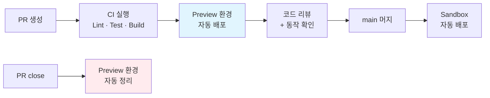
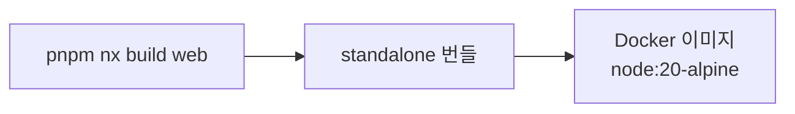
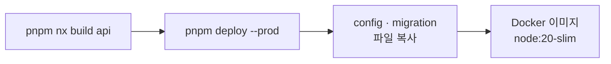
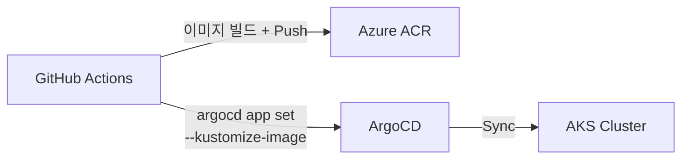
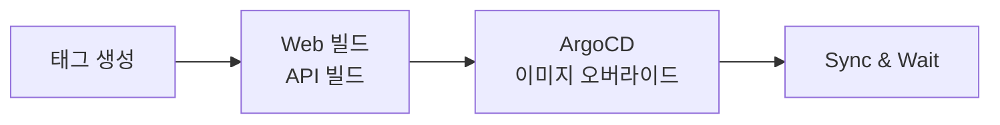

"배포 좀 해주세요."

팀에서 이 말이 나오기 시작하면 CI/CD 파이프라인을 만들 때다. 개발자가 코드를 작성하고, 그 코드가 프로덕션에 닿기까지의 모든 과정을 자동화하는 것. 말은 쉽지만 모노레포에서는 생각보다 까다롭다.

이 글은 Next.js 프론트엔드와 NestJS API가 하나의 레포에 공존하는 모노레포 프로젝트에서, GitHub Actions + ArgoCD + AKS로 CI/CD 파이프라인을 구축한 실전 경험이다. PR을 올리면 격리된 Preview 환경이 자동으로 생성되고, PR을 닫으면 DB 스키마까지 포함해서 깨끗하게 정리되는 구조다.

## PR 하나의 생명주기

이 파이프라인이 하는 일을 한 문장으로 요약하면, **PR의 생명주기에 맞춰 환경을 만들고 지우는 것**이다.



Git 이벤트 세 가지에 워크플로우 세 개가 1:1로 대응한다.

| Git 이벤트 | 워크플로우 | 결과 |
|------------|-----------|------|
| PR 생성/업데이트 | `ci.yml` | 테스트 → 빌드 → Preview 배포 |
| main push | `deploy-sandbox.yml` | Sandbox 환경 자동 배포 |
| PR close | `cleanup-preview.yml` | Preview 환경 완전 정리 |

원칙은 단순하다. PR이 열리면 환경이 생기고, 닫히면 사라진다.

## 모노레포의 첫 번째 문제: 뭘 빌드해야 하는가

API 컨트롤러 한 줄을 고쳤는데 Next.js 빌드가 돌아간다. 모노레포에서 가장 먼저 부딪히는 문제다.

해결책은 **두 겹의 필터링**이다.

첫 번째 겹은 `dorny/paths-filter`다. CI 파이프라인의 맨 앞에서 어떤 디렉토리가 바뀌었는지 감지한다.

```yaml
# 변경 영역 감지
web: apps/web/**, libs/**, package.json
api: apps/api/**, libs/**, package.json
```

Web만 바뀌면 API 빌드를 건너뛴다. 공유 라이브러리(`libs/`)가 바뀌면 양쪽 다 빌드한다. 여기서 이미 불필요한 빌드의 상당 부분이 걸러진다.

두 번째 겹은 Nx의 `affected` 명령이다. `pnpm nx affected -t test`는 모노레포의 의존성 그래프를 분석해서, 실제로 변경에 영향받는 프로젝트만 테스트를 실행한다. `libs/` 안에도 여러 패키지가 있는데, 의존 관계가 없는 패키지까지 테스트하지 않는다.

여기에 하나 더. 같은 PR에 커밋을 연속으로 push하면 이전 CI가 자동 취소된다.

```yaml
concurrency:
  group: ci-${{ github.event.pull_request.number }}
  cancel-in-progress: true
```

세 줄이지만 효과가 크다. "아, 오타 수정" 커밋을 push할 때마다 이전 빌드가 끝날 때까지 기다리지 않아도 된다.

## Preview 환경: 세 가지 차원의 격리

이 파이프라인에서 가장 공들인 부분이다.

PR마다 완전히 격리된 Preview 환경을 자동으로 만든다. "완전히 격리"라는 말이 핵심인데, 세 가지 차원에서 분리한다.

**첫째, Kubernetes 네임스페이스.**

PR #42가 올라오면 `pr-42` 네임스페이스가 생성된다. Web Deployment, API Deployment, Service, Ingress가 이 안에 배치된다. PR #43의 리소스와 물리적으로 분리된다.

**둘째, 데이터베이스.**

여기서 가장 고민했다. 선택지가 두 가지였다.

- PR마다 PostgreSQL 인스턴스를 새로 띄우기 — 완벽한 격리지만 리소스 낭비가 심하다
- 하나의 인스턴스에서 스키마로 격리하기 — 가벼우면서 충분한 격리

PostgreSQL의 스키마 격리를 선택했다. PR #42는 `pr_42` 스키마를 사용한다. Migration Job이 ArgoCD PreSync Hook으로 실행되면서 테이블을 초기화한다. 인스턴스 하나로 수십 개 PR의 데이터를 격리할 수 있다.

**셋째, 네트워크 진입점.**

Ingress에 `pr-42.{도메인}` 호스트를 설정한다. nip.io를 활용하면 별도 DNS 설정 없이 IP 기반으로 바로 접근 가능하다.

이 세 가지 격리를 **Kustomize overlay** 하나로 관리한다.

```
manifests/
├── apps/
│   ├── base/               # 공통 Deployment, Service
│   │   ├── api/
│   │   ├── web/
│   │   ├── ingress.yaml
│   │   └── sealed-secret.yaml
│   └── kustomization.yaml
└── overlays/
    └── pr/                  # PR별 오버라이드
        ├── cleanup-job.yaml # DB schema DROP Hook
        └── kustomization.yaml
```

base는 공통이고, PR 번호·스키마·호스트만 patch로 주입한다. PR이 10개 열려도 매니페스트를 10벌 작성할 필요가 없다.

## 빌드: 같은 모노레포, 다른 전략

같은 레포의 두 앱인데, 빌드 방식이 다르다.

### Web — Next.js Standalone



Next.js의 standalone 모드는 서버 코드와 필요한 node_modules를 하나의 디렉토리로 묶어준다. Nx 모노레포에서는 `outputFileTracingRoot`를 레포 루트로 설정해야 의존성을 제대로 추적한다. 이 설정 하나를 빠뜨리면 빌드는 되는데 런타임에 모듈을 못 찾는 함정이 있다.

Base image는 `node:20-alpine`. 순수 JavaScript 실행이라 경량 이미지로 충분하다.

### API — NestJS + pnpm deploy



API는 `pnpm deploy --filter=api --prod`로 프로덕션 의존성만 추출한다. 그런데 하나 문제가 있었다. PDF 처리 기능에서 canvas 네이티브 모듈이 필요한데, canvas는 glibc를 요구한다. Alpine은 musl libc라서 호환되지 않는다.

결국 API의 base image를 `node:20-slim`(Debian 기반)으로 바꿨다. 이미지 크기는 alpine 대비 3배 가까이 커졌지만, 네이티브 모듈 호환성은 타협할 수 없었다. DB migration 파일과 LLM 관련 config 파일은 빌드 결과물에 포함되지 않으므로 별도로 Docker context에 복사한다.

### 이미지 태그 전략

| 환경 | 태그 패턴 | 이유 |
|------|-----------|------|
| PR Preview | `pr-42-a1b2c3d` | 특정 커밋에 고정 |
| Sandbox | `20260302-143000-a1b2c3d` + `latest` | 시간 기반 정렬 + 최신 참조 |

PR 태그에 `latest`를 붙이지 않는 이유가 있다. Preview 환경은 리뷰어가 "이 커밋의 결과"를 확인하는 곳이다. 새 커밋이 push되면 새 태그가 생기고, ArgoCD가 이 태그로 sync한다.

## GitOps 배포: CI와 CD의 경계

GitHub Actions와 ArgoCD의 역할 분담이 깔끔하다.



GitHub Actions는 이미지를 빌드해서 ACR에 올리고, ArgoCD에 "이 이미지 태그로 배포해"라고 알려준다. 여기까지가 CI의 끝이다. 실제 Kubernetes 리소스를 만들고, 롤백하고, health check를 하는 건 ArgoCD의 몫이다.

핵심 명령은 `argocd app set --kustomize-image`다. 매니페스트 YAML을 직접 수정하는 게 아니라, ArgoCD Application의 이미지 오버라이드만 변경한다. ArgoCD가 diff를 감지하고 자동으로 sync한다.

시크릿은 **SealedSecrets**로 관리한다. 공개키로 암호화한 시크릿 파일을 Git에 커밋한다. 클러스터의 SealedSecret 컨트롤러만이 복호화할 수 있다. cluster-wide scope로 설정해서 PR별 네임스페이스에서도 동일한 시크릿을 사용할 수 있다.

## Cleanup: 만드는 것보다 중요한 것

Preview 환경을 만드는 건 재미있다. 하지만 정리하지 않으면 클러스터가 PR의 잔해로 뒤덮인다. 오래된 네임스페이스, 방치된 DB 스키마, 쌓이는 컨테이너 이미지.

PR이 닫히면 `cleanup-preview.yml`이 다섯 가지를 순서대로 정리한다.

```
1. Git Tags 삭제          ← ArgoCD 리비전 참조 먼저 제거
2. ArgoCD Application 삭제 ← cascade로 하위 리소스 정리
3. K8s Namespace 삭제      ← 안의 모든 리소스가 함께 사라짐
4. DB Schema DROP          ← PreDelete Hook Job이 실행
5. 컨테이너 이미지          ← ACR retention policy가 자동 처리
```

순서가 중요하다. ArgoCD Application을 먼저 지우면 Git Tag가 고아가 된다. Tag를 먼저 지우고, Application을 cascade 삭제하면 Deployment → Pod → Service까지 연쇄적으로 정리된다.

DB 스키마 정리는 Kubernetes의 PreDelete Hook을 활용한다. Application이 삭제되기 직전에 Job이 실행되면서 `DROP SCHEMA pr_42 CASCADE`를 수행한다. 데이터가 남지 않는다.

ACR의 컨테이너 이미지는 retention policy에 맡긴다. 일정 기간이 지나면 자동 삭제된다. 이건 수동으로 할 필요가 없다.

## Sandbox 배포: main의 흐름

PR이 머지되면 `deploy-sandbox.yml`이 동작한다. Preview보다 단순하다.



Web과 API를 병렬로 빌드한다. 독립적인 앱이니까 순서가 없다. 빌드가 끝나면 ArgoCD에 새 이미지 태그를 넘기고, sync가 완료될 때까지 기다린다.

Preview와 다른 점은 네임스페이스와 DB 스키마가 고정이라는 것이다. Sandbox는 "최신 main 코드가 항상 돌아가는 환경"이므로 매번 새로 만들 필요가 없다.

## 돌아보며

이 파이프라인이 완벽한 건 아니다.

Smoke Test가 아직 빈 칸이다. Preview 환경이 뜨는 것까지는 확인하지만, 로그인이 되는지, API가 응답하는지 자동으로 검증하지 못한다. Playwright E2E를 붙이려고 계획만 세워둔 상태다.

SealedSecrets는 키 로테이션 시 모든 시크릿을 재암호화해야 한다. 아직 시크릿이 10개 미만이라 수동으로 가능하지만, 늘어나면 스크립트가 필요할 것이다.

Preview 환경의 첫 배포는 cold start 때문에 3분 정도 걸린다. 이미지 풀에 시간이 소요되는데, AKS 노드의 이미지 캐시나 ACR의 proximity placement로 개선할 수 있다.

그래도 이 구조가 주는 가장 큰 가치는 명확하다. **개발자가 "배포 좀 해주세요"라고 말할 일이 없어졌다.** PR을 올리면 환경이 생기고, 리뷰어가 직접 동작을 확인하고, 머지하면 Sandbox에 반영된다. 사람이 개입하는 지점은 "코드 작성"과 "리뷰 승인" 뿐이다.
