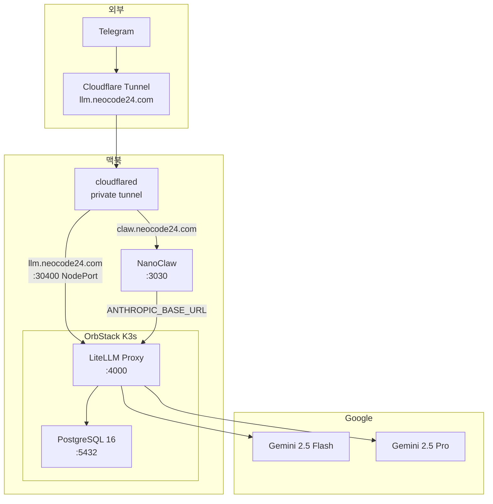

Claude 구독 만료 대비 LLM fallback 인프라. NanoClaw 코드 수정 없이 `.env` 전환만으로 Gemini 기반 운영이 가능하다.

## 인프라 구성



## 구성 요소

| 구성 요소 | 스펙 | 비고 |
|-----------|------|------|
| LiteLLM Proxy | `ghcr.io/berriai/litellm:main-latest` | K8s Deployment, 1Gi 메모리 |
| PostgreSQL | 16-alpine | 사용자/키/로그 저장, PVC 1Gi |
| Cloudflare Tunnel | private tunnel | claw + llm 2개 ingress |
| Gemini API | AI Studio 무료 티어 | gemini-2.5-flash, gemini-2.5-pro |

## 모델 매핑

NanoClaw는 Claude 모델명으로 요청하지만, LiteLLM `model_group_alias`가 Gemini로 라우팅한다.

| 요청 모델 (Claude) | 실제 호출 (Gemini) |
|--------------------|--------------------|
| claude-opus-4-6 | gemini-2.5-pro |
| claude-sonnet-4-6 | gemini-2.5-flash |
| claude-haiku-4-5 | gemini-2.5-flash |

Fallback 체인: flash - pro 상호 대체.

## NanoClaw 전환 방법

`.env` 파일에서 주석만 변경하면 된다.

### Claude 모드 (기본)
```env
CLAUDE_CODE_OAUTH_TOKEN=sk-ant-oat01-...

#ANTHROPIC_BASE_URL=https://llm.example.com
#ANTHROPIC_AUTH_TOKEN=sk-litellm-...
```

### Gemini fallback 모드
```env
#CLAUDE_CODE_OAUTH_TOKEN=sk-ant-oat01-...

ANTHROPIC_BASE_URL=https://llm.example.com
ANTHROPIC_AUTH_TOKEN=sk-litellm-...
```

전환 후 서비스 재시작:
```bash
launchctl kickstart -k gui/$(id -u)/com.nanoclaw
```

## Cloudflare Tunnel

하나의 터널로 두 서비스를 수용한다.

| hostname | service | 용도 |
|----------|---------|------|
| claw.example.com | localhost:3030 | NanoClaw webhook |
| llm.example.com | localhost:30400 | LiteLLM NodePort |

## K8s 배포

namespace: `litellm`

```bash
# 리소스 확인
kubectl -n litellm get all

# ConfigMap 업데이트 (config.yaml 변경 시)
kubectl -n litellm create configmap litellm-config \
  --from-file=config.yaml=config.yaml \
  --dry-run=client -o yaml | kubectl apply -f -

# 재시작
kubectl -n litellm rollout restart deployment litellm
```

## 전원 및 Sleep 동작

맥북 기반 인프라이므로 전원/sleep 상태에 따라 서비스 가용성이 달라진다.

### macOS 전원 설정 (pmset)

| 항목 | 배터리 | AC 전원 |
|------|--------|---------|
| sleep | 1분 후 sleep | **0 (sleep 안 함)** |
| displaysleep | 5분 | 10분 |
| tcpkeepalive | 1 (유지) | 1 (유지) |

### 시나리오별 동작

| 시나리오 | NanoClaw | 스케줄 | cloudflared |
|----------|----------|--------|-------------|
| AC 전원 + 뚜껑 열림 | 정상 | 정상 | 정상 |
| AC 전원 + 뚜껑 닫힘 | 정상 (디스플레이만 off) | 정상 | 정상 |
| 배터리 + 뚜껑 닫힘 | **중단** (clamshell sleep) | **중단** | **중단** |
| sleep 중 뚜껑 열기 + AC 연결 | 복구 | 복구 | ~1분 후 복구 |

### 핵심 규칙

- `sleep=0`(AC)은 idle sleep 비활성화이며, **clamshell sleep과 무관**
- 뚜껑 닫으면 `sleep` 값에 상관없이 즉시 sleep 진입
- clamshell sleep 없이 뚜껑을 닫으려면 AC + 외부 디스플레이 필요

### 네트워크 전환 시 복구 동작

IP 변경(WiFi - 테더링 전환) 시 검증 결과:

1. **cloudflared**: sleep 후 깨어나면 ~1분 내 자동 재연결
2. **Telegram webhook**: cloudflared 복구 전까지 530/502 에러, 복구 후 pending 메시지 자동 재전송
3. **NanoClaw 컨테이너**: sleep 중 컨테이너가 kill(code 137)되면 자동 재시도(5초 backoff)로 복구
4. **스케줄 태스크**: `next_run <= 현재시간` 조건으로 조회하므로, sleep 중 밀린 스케줄도 깨어난 직후 즉시 실행

## 사내 VPN (ZTNA) 인증서 처리

사내 VPN 연결 시 ZTNA가 모든 HTTPS 트래픽을 MITM하여 자체 CA로 인증서를 재발급한다. Node.js와 Docker 컨테이너는 별도 처리가 필요하다.

### 호스트 (NanoClaw 프로세스)

launchd plist에 `NODE_EXTRA_CA_CERTS` 환경변수 추가:

```xml
<key>NODE_EXTRA_CA_CERTS</key>
<string>/path/to/corp-proxy-root.crt</string>
```

### 컨테이너 (Claude Agent)

`container-runner.ts`에서 CA 파일이 존재하면 자동으로 bind mount + 환경변수 설정:

```typescript
const corpCaPath = path.join(os.homedir(), 'Self-Signed-Certificate', 'corp-proxy-root.crt');
if (fs.existsSync(corpCaPath)) {
  args.push('-v', `${corpCaPath}:/usr/local/share/ca-certificates/corp-proxy-root.crt:ro`);
  args.push('-e', 'NODE_EXTRA_CA_CERTS=/usr/local/share/ca-certificates/corp-proxy-root.crt');
}
```

- `NODE_EXTRA_CA_CERTS`는 Node.js 기본 CA 저장소에 **추가** CA를 등록
- SSL 검증 비활성화가 아닌 정당한 CA 추가 방식
- VPN 미사용 시에도 영향 없음 (추가 CA일 뿐)
- CA 파일이 없으면 mount 자체를 건너뜀

## 제약 사항

- **VPN-Tunnel 충돌**: 사내 VPN 활성화 시 Cloudflare Tunnel 불가
- **Gemini 무료 티어 제한**: rate limit 및 사용량 제한 존재
- **도구 호환성**: Claude Agent SDK의 tool use가 Gemini에서 완전히 호환되지 않을 수 있음
