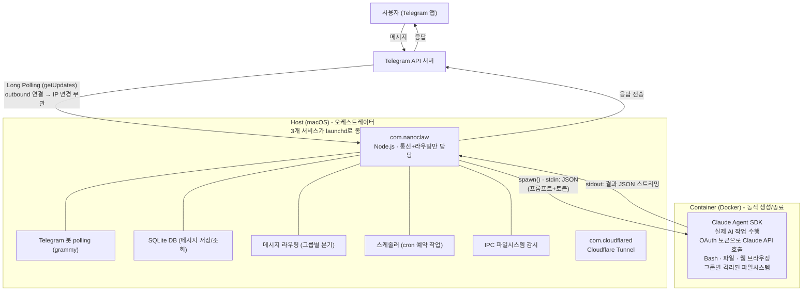
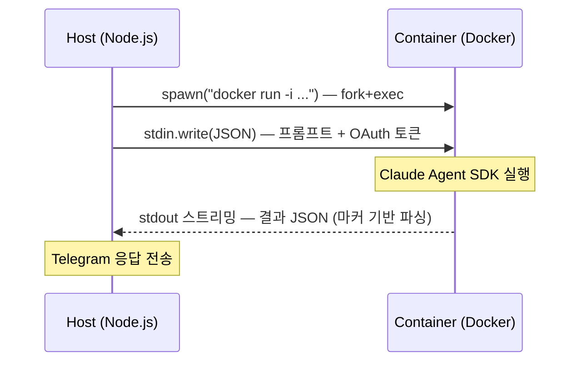
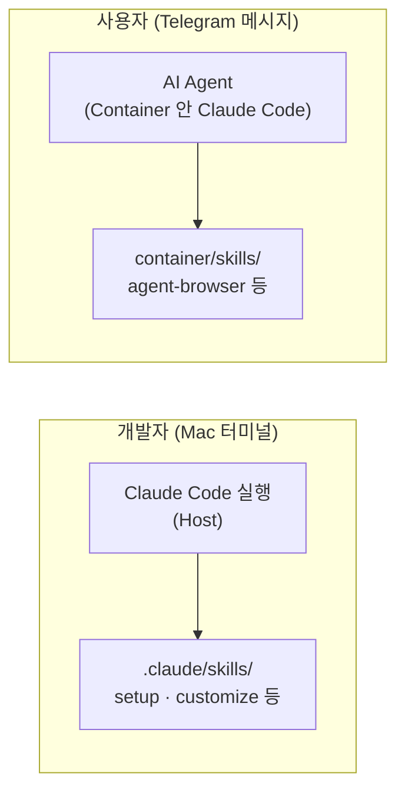

> 개인 AI 어시스턴트 NanoClaw의 전체 아키텍처, 동작 구조, 운영 방법 정리

## 개요

NanoClaw는 Claude Agent SDK 기반으로 만들어진 개인 AI 어시스턴트이다. Claude Code를 컨테이너 안에서 실행하여 보안을 확보하면서, Telegram 등 메신저를 통해 사용자와 소통한다.

NanoClaw 자체가 Claude Agent SDK 위에 만들어졌기 때문에 Claude Code의 기능(스킬, 에이전트, MCP 등)을 그대로 활용한다.

- 기반 기술: Claude Agent SDK (= Claude Code)
- 원본: qwibitai/NanoClaw (오픈소스)
- 어시스턴트 이름: Jay Claw

## 전체 아키텍처



## Host와 Container 역할 분리

| | Host (오케스트레이터) | Container (AI Agent) |
|---|---|---|
| 역할 | 통신, 라우팅, 스케줄링 | AI 사고, 코드 실행, 작업 수행 |
| 기술 | Node.js, grammy, SQLite | Claude Agent SDK (Claude Code) |
| AI 처리 | 안 함 | Claude API 호출하여 수행 |
| 보안 | Host 시스템 보호 | 격리된 환경에서 실행 |

이 분리가 NanoClaw의 핵심 설계이다. Host는 메시지를 받아서 전달만 하고, 실제 "생각하고 실행하는" 부분은 격리된 컨테이너 안에서 일어난다. Claude에게 Bash 접근을 줘도 Host 시스템이 안전하다.

## 주요 컴포넌트

| 컴포넌트 | 파일 | 실행 위치 | 역할 |
|----------|------|-----------|------|
| 오케스트레이터 | src/index.ts | Host | 메시지 수신/발신, DB, 라우팅, 스케줄링 |
| Telegram 채널 | src/channels/telegram.ts | Host | grammy 기반 봇 연결, 메시지 송수신 |
| 컨테이너 러너 | src/container-runner.ts | Host | 컨테이너 생성, stdin/stdout 통신, 볼륨 마운트 |
| IPC 워처 | src/ipc.ts | Host | 컨테이너-호스트 파일 기반 명령 처리 |
| 스케줄러 | src/task-scheduler.ts | Host | cron 기반 예약 작업 실행 |
| Agent Runner | container/agent-runner/ | Container | Claude Agent SDK로 AI 작업 수행 |

## Telegram Polling 구조

NanoClaw는 Webhook이 아닌 Long Polling 방식을 사용한다.

| 방식 | 동작 | 요구사항 |
|------|------|----------|
| Webhook | Telegram → POST → 내 서버 | 공인 IP, 도메인, HTTPS 필요 |
| Polling (사용 중) | NanoClaw → GET → Telegram API 반복 | 인터넷 연결만 있으면 됨 |

grammy 라이브러리의 `bot.start()`가 내부적으로 Telegram의 `getUpdates` API를 반복 호출한다. NanoClaw가 Telegram에게 "새 메시지 있어?"라고 계속 물어보는 방식이므로 공인 IP나 터널 없이 동작한다.

## Host-Container 통신 방식

HTTP 서버가 아닌 프로세스 stdin/stdout 파이프로 통신한다.



- `spawn()`은 커널의 fork() + exec() 호출 (새 프로세스에서 Docker 바이너리 실행)
- 결과 파싱은 마커 기반 (`---OUTPUT_START---` / `---OUTPUT_END---`)
- 시크릿(OAuth 토큰)은 stdin으로만 전달되고, 전달 후 메모리에서 즉시 삭제

## Claude Code 스킬 시스템

NanoClaw는 Claude Agent SDK 위에 만들어졌으므로 Claude Code의 스킬 시스템을 그대로 활용한다.



### Host 맥락: NanoClaw 커스터마이징용

| 스킬 | 용도 |
|------|------|
| /setup | 최초 설치, 인증, 서비스 설정 |
| /customize | 채널 추가, 동작 변경 |
| /add-telegram | Telegram 채널 추가 (polling 방식) |
| /update-nanoclaw | upstream 변경사항 동기화 |

### Container 맥락: 에이전트 도구

| 스킬 | 용도 |
|------|------|
| agent-browser | 웹 브라우징 자동화 |
| vault-to-blog | Vault 노트를 블로그로 변환/발행/관리 |

## 보안 격리 모델

| 보안 요소 | 구현 방식 |
|-----------|-----------|
| 파일시스템 격리 | 그룹별 volume mount, 다른 그룹 접근 불가 |
| 프로젝트 보호 | 프로젝트 루트는 read-only 마운트 |
| 시크릿 관리 | stdin으로만 전달, 파일/환경변수에 노출 안 됨 |
| 마운트 보안 | mount-allowlist.json으로 허용 경로 제한 |
| IPC 격리 | 그룹별 별도 IPC 디렉토리 |
| 세션 격리 | 그룹별 별도 .claude/ 디렉토리 |

## 그룹 시스템

| 구분 | 트리거 | 권한 |
|------|--------|------|
| main | 트리거 없이 모든 메시지 처리 | 프로젝트 read-only, 그룹 관리 |
| 일반 그룹 | @멘션 필요 | 자기 그룹 폴더만 접근 |
| DM | 트리거 없이 처리 | 자기 그룹 폴더만 접근 |

## 서비스 구성

launchd로 서비스가 동시 실행된다:

| 서비스 | 실행 방식 |
|--------|-----------|
| NanoClaw 오케스트레이터 | `npx tsx src/index.ts` |
| Cloudflare Tunnel | `cloudflared tunnel run` |
| Container (에이전트) | `docker run -i nanoclaw-agent` (동적 생성/종료) |

## Upstream 동기화

```bash
git fetch upstream
git merge upstream/main
# 또는 Claude Code에서 /update-nanoclaw 스킬 사용
```
