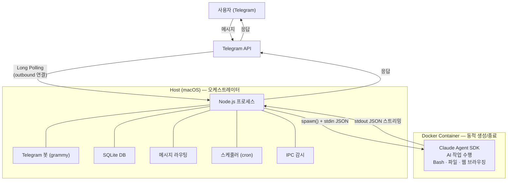
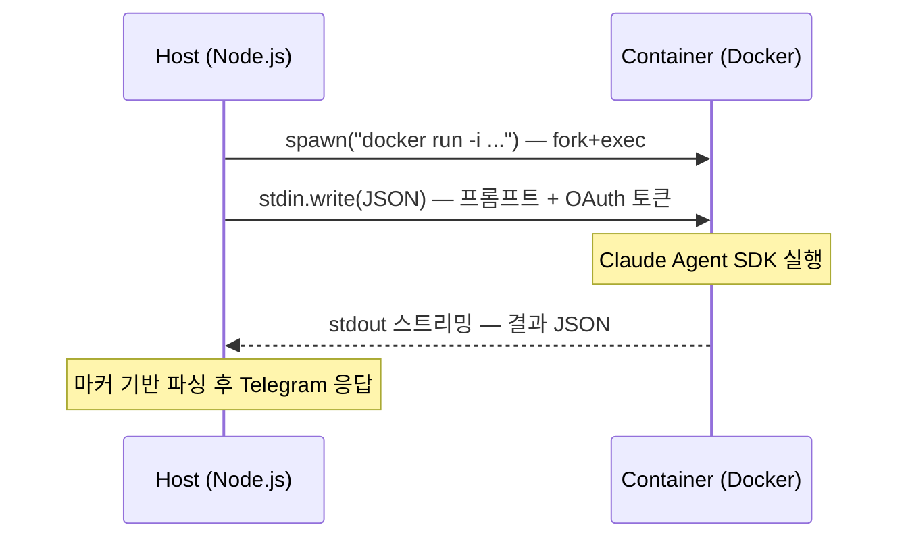
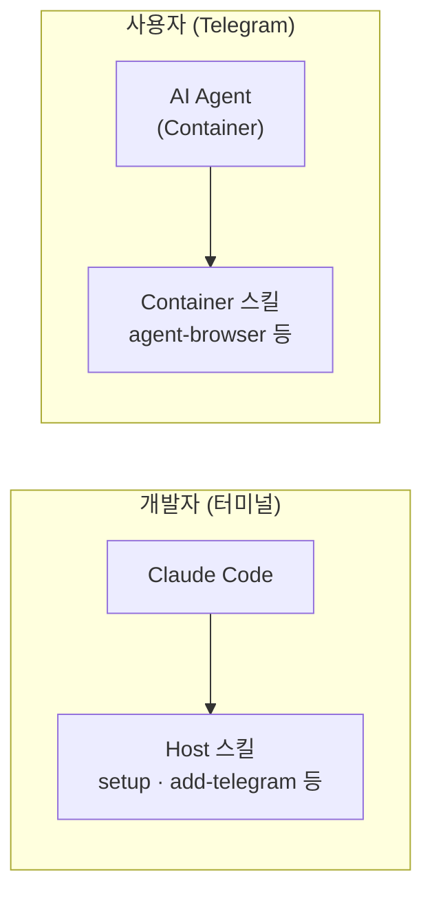

AI 에이전트에게 터미널 접근 권한을 주면 강력해진다. 파일을 읽고, 코드를 실행하고, 웹을 탐색하고, git push까지 할 수 있다. 문제는 **보안**이다. 에이전트가 실수로 시스템 파일을 지우거나, 의도치 않은 명령을 실행하면 어떻게 될까?

NanoClaw는 이 문제를 **Host-Container 분리**로 해결한다. 메시지를 주고받는 오케스트레이터는 Host에서, 실제 AI가 "생각하고 실행하는" 부분은 격리된 Docker 컨테이너 안에서 동작한다. Claude에게 Bash를 줘도 Host 시스템이 안전한 구조다.

## NanoClaw가 뭔가

NanoClaw는 Claude Agent SDK(= Claude Code) 기반의 오픈소스 개인 AI 어시스턴트다. Telegram으로 메시지를 보내면 Claude가 응답하는데, 단순한 챗봇이 아니다. 파일 읽기/쓰기, 코드 실행, 웹 브라우징, 예약 작업까지 가능한 **풀스택 에이전트**다.

핵심 특징:
- **Claude Agent SDK 기반**: Claude Code의 모든 기능(스킬, MCP, 에이전트)을 그대로 활용
- **컨테이너 격리**: AI가 실행하는 모든 것이 Docker 안에서 샌드박싱
- **메신저 연동**: Telegram Long Polling으로 공인 IP 없이 동작
- **스킬 확장**: 웹 브라우징, vault 관리, 블로그 발행 등 커스텀 스킬 추가 가능

## 전체 아키텍처

한 문장으로 요약하면: **Host는 메시지 배달부, Container는 두뇌**다.

## 왜 Host-Container를 분리했는가

AI 에이전트 아키텍처에서 가장 중요한 설계 결정이다.

| | Host (오케스트레이터) | Container (AI Agent) |
|---|---|---|
| **역할** | 통신, 라우팅, 스케줄링 | AI 사고, 코드 실행, 작업 수행 |
| **기술** | Node.js, grammy, SQLite | Claude Agent SDK |
| **AI 처리** | 안 함 | Claude API 호출 |
| **보안** | Host 시스템 보호 | 격리된 환경에서 자유롭게 실행 |

Host가 Claude API를 직접 호출하지 않는다는 점이 핵심이다. Host는 메시지를 받아서 컨테이너에 전달하고, 결과를 받아서 Telegram에 보내는 **패스스루** 역할만 한다. AI가 `rm -rf /`를 실행해도 컨테이너 안에서만 일어난다.

이 구조 덕분에:
- 에이전트에게 Bash 전체 권한을 줘도 안전
- 그룹별로 파일시스템을 완전히 격리 가능
- 에이전트가 죽어도 Host는 정상 동작
- 시크릿(OAuth 토큰)이 컨테이너 파일시스템에 노출되지 않음

## Host-Container 통신: stdin/stdout 파이프

HTTP 서버가 아니다. 프로세스의 stdin/stdout 파이프로 통신한다.

왜 HTTP가 아닌 파이프인가?

1. **보안**: 네트워크 포트를 열지 않으므로 외부 접근 차단
2. **단순함**: 서버 구동, 포트 관리, 연결 풀링 불필요
3. **시크릿 전달**: OAuth 토큰을 stdin으로 전달하고 즉시 메모리에서 삭제. 환경변수나 파일에 남지 않음

결과 파싱은 마커 기반이다. 출력 시작과 끝에 특정 마커 문자열을 삽입하고, Host가 이를 감지해서 JSON을 추출한다.

## Telegram: 왜 Polling인가

| 방식 | 동작 | 요구사항 |
|------|------|----------|
| **Webhook** | Telegram → POST → 내 서버 | 공인 IP, 도메인, HTTPS |
| **Polling** (사용 중) | NanoClaw → GET → Telegram API 반복 | 인터넷 연결만 |

NanoClaw의 기본 철학은 **"개인 노트북에서 돌아가는 어시스턴트"**다. 집 WiFi, 카페, 테더링 — 어디서든 인터넷만 있으면 동작해야 한다. Webhook은 공인 IP와 도메인이 필요하지만, Polling은 outbound 연결만 하므로 NAT 뒤에서도 문제없다.

grammy 라이브러리의 `bot.start()`가 Telegram의 `getUpdates` API를 반복 호출한다. IP가 바뀌어도(WiFi → 테더링 전환) outbound 연결이라 즉시 정상 동작한다.

## 보안 격리 모델

보안은 여러 레이어로 구성된다.

| 보안 요소 | 구현 방식 |
|-----------|-----------|
| **파일시스템 격리** | 그룹별 volume mount, 다른 그룹 데이터 접근 불가 |
| **프로젝트 보호** | 프로젝트 루트는 read-only 마운트 |
| **시크릿 관리** | stdin으로만 전달, 파일/환경변수에 노출 안 됨 |
| **마운트 보안** | allowlist로 허용 경로를 명시적으로 제한 |
| **IPC 격리** | 그룹별 별도 IPC 디렉토리 |
| **세션 격리** | 그룹별 별도 .claude/ 디렉토리 |

특히 시크릿 관리가 인상적이다. Claude API 인증에 필요한 OAuth 토큰은 stdin으로만 전달된다. 컨테이너 내부의 환경변수나 파일시스템 어디에도 토큰이 남지 않는다.

## 스킬 시스템: 두 가지 맥락

NanoClaw는 Claude Code 위에 만들어졌으므로 스킬 시스템을 그대로 활용한다. 재미있는 점은 같은 스킬 시스템이 **두 가지 다른 맥락**에서 동작한다는 것이다.

### Host 스킬: NanoClaw 자체를 변경

개발자가 터미널에서 `claude`를 실행하고 사용하는 스킬이다. NanoClaw 소스코드를 변환하는 "메타 스킬"이다.

| 스킬 | 용도 |
|------|------|
| /setup | 최초 설치, 인증, 서비스 등록 |
| /add-telegram | Telegram 채널 추가 |
| /update-nanoclaw | upstream 변경사항 동기화 |
| /customize | 채널 추가, 동작 변경 |

`/add-telegram`을 실행하면 Telegram 관련 코드가 자동으로 프로젝트에 추가된다. 코드 생성 도구인 셈이다.

### Container 스킬: 에이전트의 능력 확장

AI 에이전트가 사용자 메시지에 응답하면서 사용하는 도구다.

| 스킬 | 용도 |
|------|------|
| agent-browser | 웹 페이지 열기, 클릭, 폼 작성, 스크린샷, 데이터 추출 |
| vault-to-blog | Obsidian 노트를 블로그로 변환, 발행, 관리 |

이 스킬들은 `container/skills/`에 정의하고, 컨테이너 실행 시 에이전트의 `.claude/skills/`로 자동 복사된다.

## 그룹 시스템: 멀티 테넌시

하나의 NanoClaw 인스턴스로 여러 Telegram 그룹/채팅을 서빙할 수 있다.

| 구분 | 트리거 | 권한 |
|------|--------|------|
| **main** | 트리거 없이 모든 메시지 처리 | 프로젝트 read-only, 그룹 관리, 전체 태스크 조회 |
| **일반 그룹** | @멘션 필요 | 자기 그룹 폴더만 접근 |
| **DM** | 트리거 없이 처리 | 자기 그룹 폴더만 접근 |

각 그룹은 완전히 격리된 파일시스템을 가진다. A 그룹의 에이전트가 B 그룹의 데이터에 접근할 수 없다. 컨테이너 볼륨 마운트 레벨에서 차단되므로 우회가 불가능하다.

## 서비스 구성

macOS의 launchd로 관리된다.

| 서비스 | 역할 | 실행 방식 |
|--------|------|-----------|
| 오케스트레이터 | 메시지 수신/발신, 라우팅 | launchd 상주 프로세스 |
| Cloudflare Tunnel | 외부 서비스 연결 | launchd 상주 프로세스 |
| Container (에이전트) | AI 작업 수행 | 메시지마다 동적 생성/종료 |

컨테이너는 상주하지 않는다. 메시지가 올 때 생성되고, 응답이 끝나면 종료된다. 이 ephemeral 패턴 덕분에 리소스를 아끼면서도 깨끗한 상태를 유지한다.

## 실제로 어떻게 동작하는가

사용자가 Telegram에서 "오늘 Kubernetes 뉴스 정리해줘"라고 보내면:

1. **grammy**가 Long Polling으로 메시지를 감지
2. **오케스트레이터**가 메시지를 파싱하고 해당 그룹의 설정을 로드
3. **container-runner**가 Docker 컨테이너를 생성 (그룹별 볼륨 마운트 적용)
4. **stdin**으로 프롬프트 + OAuth 토큰을 전달
5. **Claude Agent SDK**가 프롬프트를 받아 Claude API를 호출
6. Claude가 웹 검색, 정보 정리 등 작업을 수행
7. **stdout**으로 결과 JSON을 스트리밍
8. **오케스트레이터**가 결과를 파싱해서 Telegram으로 전송
9. **컨테이너 종료**

전체 과정이 몇 초에서 수십 초. 사용자 입장에서는 Telegram에서 대화하는 것처럼 느껴진다.

## 왜 이 구조를 선택했는가

AI 에이전트 아키텍처를 설계할 때 몇 가지 선택지가 있다:

1. **프로세스 내 직접 실행**: 간단하지만 보안 격리 없음
2. **VM 기반 격리**: 강력하지만 무겁고 느림
3. **컨테이너 기반 격리** (NanoClaw): 적당한 격리 + 빠른 시작 + 유연한 마운트

NanoClaw는 개인 어시스턴트다. 엔터프라이즈급 보안이 필요한 건 아니지만, "실수로 Host 시스템을 망가뜨리는" 건 막아야 한다. Docker 컨테이너는 이 요구사항에 딱 맞는 수준의 격리를 제공한다.

그리고 Claude Agent SDK 위에 만들어졌다는 점이 큰 장점이다. Claude Code의 스킬 시스템, MCP 도구, 에이전트 기능을 별도 구현 없이 그대로 쓸 수 있다. 바퀴를 다시 발명할 필요가 없었다.
