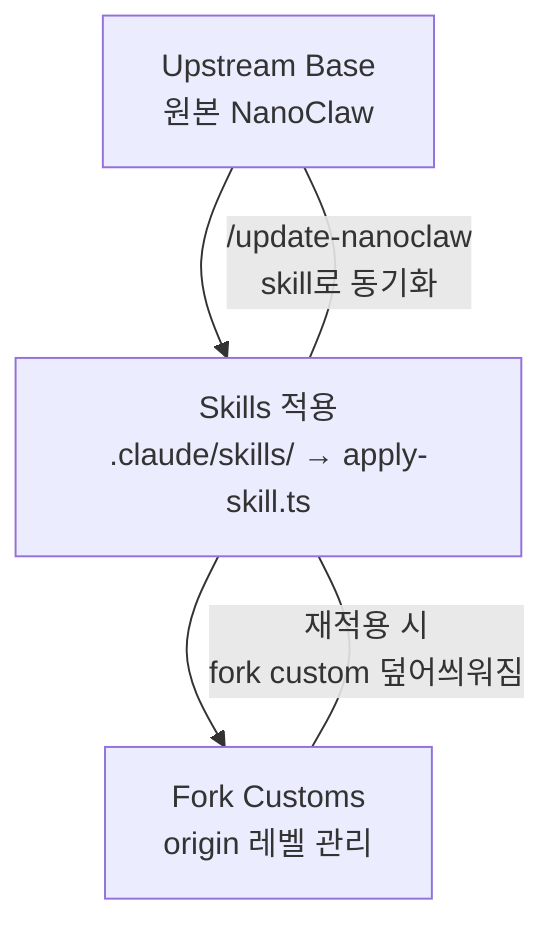
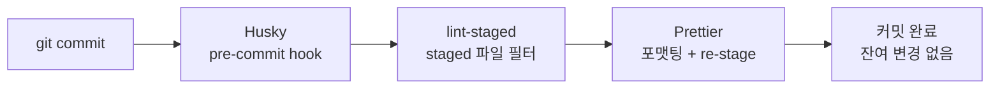
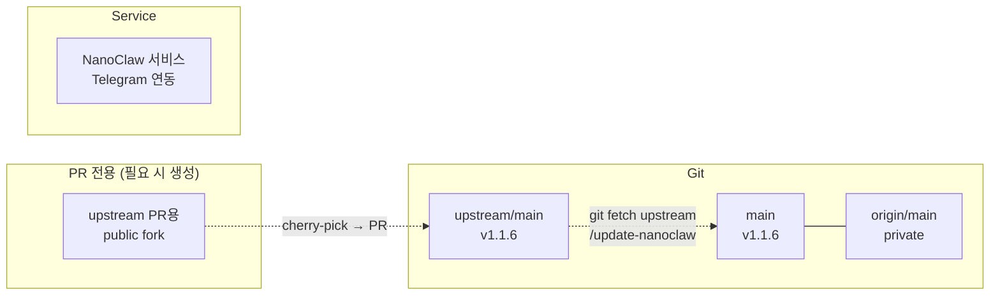

> add-telegram skill 개선, fork custom 구조 확립, 브랜치 정리, upstream 동기화까지의 전체 흐름.

## 배경

NanoClaw의 Telegram 기능을 수동 코드에서 skills engine 기반으로 전환하고, upstream과의 관계를 정리했다. 핵심 판단은 "NanoClaw 철학(개인 노트북 어시스턴트)에 맞는 것만 upstream에, 나머지는 fork custom으로 관리"이다.

## 3계층 코드 구조 확립



| 계층 | 내용 | 관리 방법 |
|------|------|-----------|
| Upstream base | NanoClaw 원본 코드 | `git merge upstream/main` 또는 `/update-nanoclaw` |
| Skills | add-telegram 등 skill 패키지 | `apply-skill.ts`로 적용, `.nanoclaw/state.yaml`에 기록 |
| Fork customs | webhook, sendImage, CLAUDE_MODEL 등 | origin/main에서 수동 관리 |

## add-telegram Skill 개선

기존 skill 템플릿 대비 추가된 기능:

| 기능 | 설명 |
|------|------|
| Webhook + Polling 듀얼모드 | `TELEGRAM_WEBHOOK_URL` 유무로 자동 분기 |
| MarkdownV2 3단계 fallback | MarkdownV2 → HTML → plain text 순차 시도 |
| telegramify-markdown | 마크다운을 Telegram MarkdownV2로 변환 |
| sendImage | InputFile 기반 이미지 전송 + IPC 연동 |
| 429 retry | Telegram API rate limit 시 `retry_after`만큼 대기 후 재시도 |

### 철학적 판단: Webhook은 Fork Custom

upstream skill 템플릿은 **polling-only**가 NanoClaw 철학에 부합한다.

| 항목 | Polling | Webhook |
|------|---------|---------|
| 설정 | 토큰만 넣으면 끝 | 공인 URL, 포트, 방화벽/터널 필요 |
| 환경 | 노트북, 가정 WiFi, NAT 뒤 OK | 공인 IP 또는 터널 필수 |
| 대상 | 개인 어시스턴트 | 프로덕션 서비스 |

webhook 관련 코드(connectWebhook, TELEGRAM_WEBHOOK_URL, WEBHOOK_PORT)는 fork custom으로만 유지.

## Fork Custom 전체 목록

| 기능 | 파일 |
|------|------|
| Telegram webhook 모드 | telegram.ts |
| sendImage + IPC | telegram.ts, index.ts |
| MarkdownV2 3단계 fallback | telegram.ts |
| 429 retry | telegram.ts |
| CLAUDE_MODEL opus 고정 | config.ts, index.ts, task-scheduler.ts |
| logger.warn 수정 | index.ts |
| scheduler-dedup | task-scheduler.ts |
| tool-use 로깅 | agent-runner/index.ts |
| 사내 VPN(ZTNA) CA 자동 주입 | container-runner.ts |
| lint-staged + .nvmrc | 개발환경 |
| 페르소나 설정 | 각종 설정 |

## 사내 VPN(ZTNA) 인증서 자동 주입 (Fork Custom)

사내 VPN 연결 시 ZTNA가 모든 HTTPS를 MITM하여 자체 CA로 인증서를 재발급한다. macOS 키체인에는 해당 Root CA가 설치되어 있지만, Node.js와 Docker 컨테이너는 별도 처리가 필요하다.

### 호스트 프로세스

launchd plist에 `NODE_EXTRA_CA_CERTS` 환경변수 추가:

```xml
<key>NODE_EXTRA_CA_CERTS</key>
<string>/path/to/corp-proxy-root.crt</string>
```

### 컨테이너 에이전트

`container-runner.ts`에서 CA 파일 존재 시 자동으로 bind mount + 환경변수 설정:

```typescript
const corpCaPath = path.join(os.homedir(), 'Self-Signed-Certificate', 'corp-proxy-root.crt');
if (fs.existsSync(corpCaPath)) {
  args.push('-v', `${corpCaPath}:/usr/local/share/ca-certificates/corp-proxy-root.crt:ro`);
  args.push('-e', 'NODE_EXTRA_CA_CERTS=/usr/local/share/ca-certificates/corp-proxy-root.crt');
}
```

- CA 파일이 없으면 mount 자체를 건너뜀 (VPN 미사용 환경에 영향 없음)
- SSL 검증 비활성화가 아닌 정당한 CA 추가 방식

## Upstream PR 정리

| PR | 결과 | 비고 |
|----|------|------|
| CJK 폰트 PR | Merged | 유일한 upstream 기여 |
| tool-use 로깅 PR | Closed (직접) | fork custom으로 유지 |
| scheduler-dedup PR | Closed (직접) | fork custom으로 유지 |
| host-commands PR | Closed (직접) | skills 철학에 안 맞음 |

add-telegram skill 개선 PR은 미진행 — webhook/sendImage/IPC가 얽혀 polling-only 분리 비용 대비 가치 낮음.

### Upstream PR 규칙 (private 전환 후)

origin repo를 private으로 전환하면서 GitHub fork 관계가 **영구 분리**되었다. public으로 되돌려도 fork 라벨은 복원되지 않는다 (GitHub 정책).

**private로 유지하는 이유:**
- VPN 인증서 경로/처리 로직 노출 방지
- `.env` 패턴, 도메인, 인프라 구성 등이 커밋 히스토리에 포함
- fork custom 코드가 개인 인프라 구조를 드러냄

**upstream PR 절차:**
1. PR 전용 public fork 생성
2. private repo에서 해당 변경만 cherry-pick하여 clean 브랜치 생성
3. public fork에 push → upstream PR 생성
4. 개인 인프라 코드가 섞이지 않도록 주의

## 브랜치 정리

모든 feature 브랜치 삭제. `main`만 남김:

```
삭제: improve/add-telegram-skill (local + origin)
삭제: feat/cjk-fonts (origin, upstream 머지 완료)
삭제: fix/scheduler-dedup (origin, main에 이미 반영)
삭제: feat/tool-use-logging (origin, main에 이미 반영)
삭제: feat/host-commands-upstream (local + origin, PR closed)
```

## Upstream 동기화

`git merge upstream/main`으로 11커밋 수용:

| 주요 변경 | 영향 |
|-----------|------|
| third-party model support | ANTHROPIC_BASE_URL/AUTH_TOKEN 추가 |
| `/update` → `/update-nanoclaw` | skills-engine 대폭 간소화, 구 update 삭제 |
| WhatsApp 메시지 정규화 | whatsapp.ts 수정 |

충돌 없이 자동 머지 완료. 전체 392 테스트 통과.

## 개발환경 개선

| 항목 | Before | After |
|------|--------|-------|
| Pre-commit hook | `npm run format:fix` (전체 포맷팅 → 잔여 변경) | `npx lint-staged` (staged만 포맷팅 + re-stage) |
| Node 버전 | 명시 없음 | `.nvmrc`로 Node 22 고정 |
| CLAUDE.md | 기본 정보만 | Work Rules 섹션 추가 |
| Auto memory | 없음 | 프로젝트별 메모리 파일 구축 |

### Git Hooks & Formatter 설정

커밋 시 staged `.ts` 파일만 자동 포맷팅되도록 Husky + lint-staged를 구성했다.

**문제**: 기존 pre-commit hook은 `src/**/*.ts` 전체를 포맷팅해서, 커밋 후 unstaged 변경이 남는 문제가 있었다. staged 파일만 포맷팅하고 자동 re-stage하도록 변경.



**관련 devDependencies**:

| 패키지 | 버전 | 역할 |
|--------|------|------|
| husky | ^9.1.7 | Git hooks 관리 |
| lint-staged | ^16.3.1 | staged 파일만 lint/format |
| prettier | ^3.8.1 | 코드 포맷터 |

### Node 22 vs 25 이슈

서비스(launchd)는 Node 22, 터미널 기본은 Node 25. `better-sqlite3` C++ 네이티브 모듈은 Node 버전 불일치 시 `ERR_DLOPEN_FAILED` 발생. `npm install`, `npm rebuild`, 테스트 모두 Node 22 환경에서 실행해야 한다.

```bash
# Node 22 환경으로 전환 후 작업
export NVM_DIR="$HOME/.nvm" && . "$NVM_DIR/nvm.sh" && nvm use 22

# better-sqlite3 리빌드 (Node 버전 변경 후 필수)
npm rebuild better-sqlite3
```

## 최종 상태



- 브랜치: `main`만 존재
- origin: **private** (fork 관계 영구 분리)
- upstream 동기화: `git fetch upstream` / `/update-nanoclaw` 정상 동작
- upstream PR: 별도 public fork 생성하여 제출
