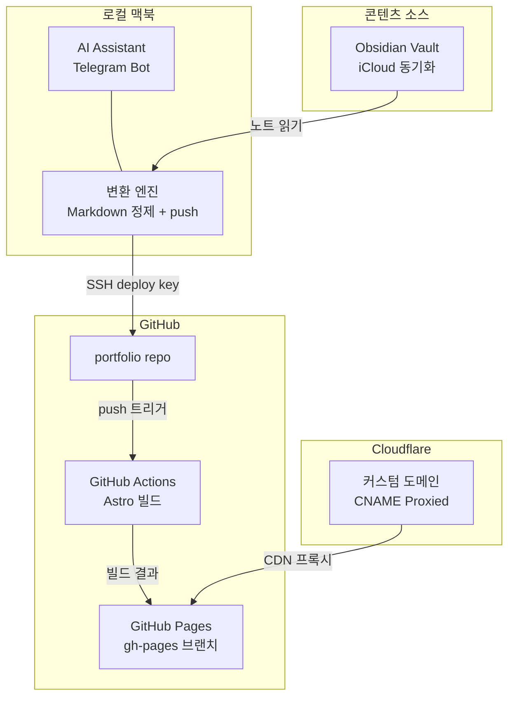

기술 블로그를 시작하려면 콘텐츠를 작성하고, 사이트를 빌드하고, 배포하는 과정을 거쳐야 한다. 나는 이미 Obsidian Vault에 수백 개의 기술 노트를 가지고 있었다. 문제는 이것을 어떻게 블로그로 옮기느냐였다.

결론부터 말하면, **Telegram에서 "블로그 발행해줘"라고 말하면 끝나는 파이프라인**을 만들었다.

## 왜 또 블로그인가

Obsidian Vault에는 Kubernetes, Docker, LLM, 인프라 구성 등 업무와 학습 과정에서 쌓아온 기술 노트가 있다. 하지만 vault 노트는 개인용이다. 백링크(`[[노트명]]`)로 연결되어 있고, 내부 경로나 작업 메모가 섞여 있어 그대로 공개할 수 없다.

원하는 것은 단순했다:
- vault 노트를 선택하면 블로그 글로 **자동 변환**
- 개인정보는 **자동 마스킹**
- 변환된 글이 **자동으로 빌드 → 배포**
- 전체 과정이 Telegram 대화 한 번으로 완료

## 전체 아키텍처



핵심은 **Obsidian → 변환 → GitHub → 빌드 → 배포**가 하나의 파이프라인으로 연결된다는 점이다. 사람이 개입하는 부분은 "어떤 노트를 발행할지" 선택하는 것뿐이다.

## K3s에서 GitHub Pages로 전환한 이유

처음에는 로컬 K3s 클러스터에서 nginx + git-sync + Cloudflare Tunnel로 서빙하려 했다. 맥북에서 K3s를 운영하고 있으니 자연스러운 선택이었다.

하지만 정적 블로그에 K3s는 과했다.

| 항목 | K3s 자체 호스팅 | GitHub Pages |
|------|----------------|--------------|
| **가용성** | 맥북 on 시만 | 24/7 |
| **인프라 복잡도** | nginx + git-sync + NodePort + tunnel ingress | 없음 |
| **CDN** | Cloudflare Tunnel 경유 | Cloudflare Proxied + GitHub CDN |
| **유지보수** | pod/sidecar 모니터링 | 관리 불필요 |

맥북이 항시 가동 중이긴 하지만, 정적 파일 서빙에 Kubernetes 오버헤드를 감수할 이유가 없었다. GitHub Pages로 전환하면서 인프라 복잡도가 대폭 줄었다.

## 프레임워크 선택: Astro

정적 사이트 프레임워크로 **Astro**를 선택했다.

- **Content Collections**: Markdown 파일을 구조화된 데이터로 관리
- **Tailwind CSS v4**: 유틸리티 기반 스타일링
- **빌드 성능**: 정적 생성 특화로 빌드가 빠르고, JS 번들이 최소화
- **Markdown 네이티브**: MDX 없이도 Markdown + frontmatter만으로 블로그 운영 가능

블로그 글은 frontmatter에 `title`, `description`, `pubDate`, `tags` 등을 정의하고, Astro의 Content Collections가 이를 자동으로 인덱싱한다.

## 콘텐츠 자동 변환 파이프라인

블로그 발행의 핵심은 **vault 노트를 블로그 Markdown으로 변환**하는 과정이다.

### 변환이 필요한 이유

Obsidian 노트는 블로그에 그대로 올릴 수 없다:

- `[[백링크]]` 문법은 Astro가 인식하지 못함
- `## Related`, `## References` 섹션은 vault 내부 네비게이션용
- 내부 서버 주소, API 키 패턴, 사내 인프라 정보가 포함될 수 있음
- frontmatter가 없거나 블로그 형식과 다름

### 자동 변환 규칙

1. **백링크 제거**: `[[노트명]]` → `노트명`, `[[원본|표시]]` → `표시`
2. **섹션 정리**: `## Related`, `## References` 섹션 삭제
3. **frontmatter 생성**: title, description, pubDate, tags 자동 구성
4. **개인정보 마스킹**: 내부 URL, 비밀 키, 특정 경로 등을 일반화

### 발행 워크플로우

실제 발행은 다음과 같이 진행된다:

1. vault에서 최근 수정된 노트 중 미발행 목록 조회
2. Telegram으로 목록 전송 → 사용자가 번호로 선택
3. 선택된 노트를 블로그 Markdown으로 변환
4. `git commit` + `git push`
5. GitHub Actions가 자동으로 Astro 빌드 → gh-pages 배포
6. Cloudflare CDN을 통해 블로그에 반영

**글 관리**도 간단하다:
- 숨기기: frontmatter에 `draft: true` 설정
- 삭제: `git rm` + push
- 복원: `draft: false`로 변경

## DNS와 배포 구성

### Cloudflare DNS

| Type | Name | Target | Proxy |
|------|------|--------|-------|
| CNAME | blog | *.github.io | Proxied |

Cloudflare의 Proxied 모드를 사용해 CDN 캐싱과 DDoS 보호를 함께 적용했다. 기존에 Cloudflare Tunnel로 서빙하던 blog 항목은 제거하고, CNAME으로 전환했다.

### GitHub Pages

- **Source**: gh-pages 브랜치 (GitHub Actions가 자동 생성)
- **HTTPS**: Enforced
- **Custom domain**: `public/CNAME` 파일로 유지
- **빌드**: `peaceiris/actions-gh-pages` 액션으로 배포

push가 발생하면 GitHub Actions가 `npm run build`로 Astro를 빌드하고, 결과물을 gh-pages 브랜치에 자동 배포한다.

## 컨테이너에서 git push하기

한 가지 재미있는 삽질이 있었다. AI 어시스턴트가 Docker 컨테이너 안에서 실행되는데, 이 컨테이너의 uid가 macOS 호스트의 uid(501)로 매핑되어 있다. 문제는 컨테이너의 `/etc/passwd`에 uid 501이 없다는 것.

OpenSSH는 내부적으로 `getpwuid()`를 호출하는데, 해당 uid에 대한 사용자 정보가 없으면 즉시 실패한다. `ssh-keyscan`, `StrictHostKeyChecking=no` 같은 옵션으로는 해결이 안 된다.

**해결 방법**: Node.js의 `ssh2` 라이브러리로 SSH 프록시를 만들었다. OpenSSH를 우회하고, Node.js 레벨에서 직접 SSH 연결 → git 프로토콜을 중계한다. `GIT_SSH` 환경변수로 이 프록시를 지정하면 `git push`가 정상 동작한다.

```bash
# SSH 프록시를 통한 git push
GIT_SSH=/tmp/git_ssh.sh git push origin main
```

사소해 보이지만, 컨테이너 환경에서 SSH 기반 git 작업을 할 때 유사한 문제를 만날 수 있다.

## 현재 구성 요약

| 구성 요소 | 역할 |
|-----------|------|
| **Obsidian Vault** | 콘텐츠 소스 (iCloud 동기화) |
| **AI 변환 엔진** | vault → blog Markdown 변환 + git push |
| **GitHub Actions** | Astro 빌드 → gh-pages 자동 배포 |
| **GitHub Pages** | 정적 파일 서빙 |
| **Cloudflare** | CNAME 프록시 + CDN + HTTPS |

## 남은 과제

- **giscus 댓글**: GitHub Discussions 기반 댓글 시스템 (이미 적용)
- **발행 리마인더**: 매주 일요일 아침에 발행 후보 노트 목록 자동 알림
- **시리즈 기능**: 연관된 글을 시리즈로 묶는 기능 검토

결국 블로그의 핵심은 **글을 쓰는 것**이지 인프라가 아니다. 발행 과정의 마찰을 최대한 줄여서, vault에 노트를 쓰는 것만큼 쉽게 블로그에 올릴 수 있도록 만들었다.
