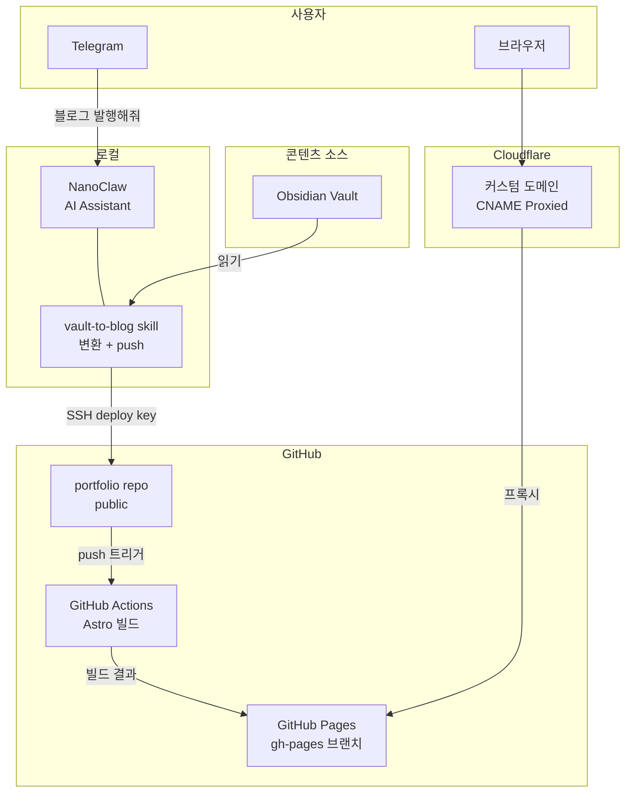

> Obsidian Vault를 콘텐츠 소스로, GitHub Pages + Cloudflare CNAME으로 서빙하는 기술 블로그. NanoClaw의 vault-to-blog skill로 발행/관리한다.

## 아키텍처

## 구성 요소

| 구성 요소 | 역할 | 비고 |
|-----------|------|------|
| Obsidian Vault | 콘텐츠 소스 | 기존 vault 활용, iCloud 동기화 |
| NanoClaw vault-to-blog | 변환 + push | Telegram 대화형, SSH deploy key |
| GitHub repo (public) | 소스 보관 + Actions 빌드 | Astro 기반 |
| GitHub Actions | Astro 빌드 → gh-pages 배포 | push 트리거, peaceiris/actions-gh-pages |
| GitHub Pages | 정적 파일 서빙 | gh-pages 브랜치, CNAME 설정 |
| Cloudflare DNS | CNAME 프록시 | Proxied 모드로 CDN + 보안 |

## K3s 서빙 폐기 사유

초기 계획은 K3s nginx + git-sync + Cloudflare Tunnel이었으나, 다음 이유로 GitHub Pages로 전환:

| 항목 | K3s 자체 호스팅 | GitHub Pages |
|------|----------------|--------------|
| 가용성 | 맥북 on 시만 | 24/7 |
| 인프라 복잡도 | nginx + git-sync + NodePort + tunnel ingress | 없음 (GitHub 관리) |
| CDN | Cloudflare Tunnel 경유 | Cloudflare Proxied CNAME + GitHub CDN |
| 유지보수 | K3s pod/sidecar 관리 필요 | 관리 불필요 |

맥북이 항시 가동이긴 하지만, 정적 블로그에 K3s 오버헤드가 불필요. GitHub Pages가 단순하고 안정적.

## Cloudflare DNS 설정

| Type | Name | Target | Proxy |
|------|------|--------|-------|
| CNAME | blog | \*.github.io | Proxied |

Cloudflare Tunnel에서 blog 항목은 제거됨. tunnel은 다른 서비스만 유지.

## GitHub Pages 설정

- Source: gh-pages 브랜치
- Custom domain 설정
- HTTPS: Enforced
- `public/CNAME` 파일로 custom domain 유지

## 콘텐츠 파이프라인

### vault-to-blog skill

Telegram에서 대화형으로 vault 노트를 선택하고 변환/push한다.

**발행 워크플로우:**
1. vault에서 최근 수정 노트 목록 조회 (미발행 필터)
2. Telegram으로 목록 전송, 사용자 선택
3. 변환: 백링크 제거, frontmatter 생성, 섹션 정리
4. `portfolio/src/data/blog/`에 저장
5. git commit + push (ssh2 프록시 경유)
6. GitHub Actions 자동 빌드 → 블로그 반영

**관리 기능:**
- 글 숨기기: frontmatter `draft: true`
- 글 삭제: `git rm` + push
- 글 복원: `draft: false`

**변환 규칙:**
- `[[백링크]]` → 텍스트, `[[원본|표시]]` → 표시 텍스트
- Related/References 섹션 제거
- frontmatter: title, description, pubDate, tags, vaultSource
- 개인정보 포함 금지 (마스킹 또는 제거)

### git push 우회 (uid 501 문제)

컨테이너가 macOS host uid(501)로 실행되지만 `/etc/passwd`에 항목이 없어 OpenSSH의 `getpwuid()` 실패. Node.js ssh2 라이브러리 기반 SSH 프록시로 우회한다.

## 정적 사이트 프레임워크

**Astro** 선택. Tailwind CSS v4, content collections, Markdown 네이티브 지원.

- `astro.config.ts`: site URL 설정
- `src/content.config.ts`: blog collection (title, description, pubDate, tags, vaultSource, draft)
- 빌드: `npm run build` → `dist/`

## 향후 계획

- giscus 댓글 (GitHub Discussions 기반, 이미 적용)
- 발행 리마인더 스케줄 태스크 검토
- API 서비스 필요 시 Cloudflare Tunnel 활용
